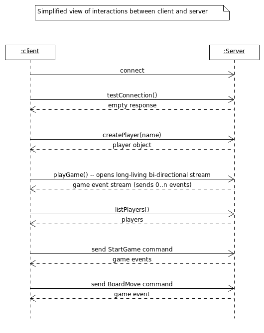

# gRPC game workshop

REQUIREMENTS: 
 * Java 11
 * Uses the gradle build system, gradle downloads itself!  
       
       ./gradlew <command> 
 
 * Tip for Intellij users: install [protocol buffers plugin](https://plugins.jetbrains.com/plugin/8277-protobuf-support/) 

Resources:
 * [Workshop Presentation](https://docs.google.com/presentation/d/1AoH7IQFmmCYjHm1BozzPpWyjITfZ4e8HF3Uezc8AFII/edit?usp=sharing)
 * [Protocol Buffers 3 docs](https://developers.google.com/protocol-buffers/docs/proto3) <- make sure to look for proto3!
 * [Protocol Buffers Java generated code guide](https://developers.google.com/protocol-buffers/docs/reference/java-generated) <- make sure to look for proto3!
 * [gRPC homepage](https://www.grpc.io/)
 * [gRPC docs](https://www.grpc.io/docs/) <- select Java or directly go to [Java generated code reference](https://www.grpc.io/docs/reference/java/generated-code/)
 * [gRPC videos](https://www.grpc.io/docs/talks/)

# Overview 
The workshop contains a simple tic-tac-toe game (boter kaas en eieren). Multiple players can join and play against each other.

There are two components: a client and and a server. Clients connect to the server using gRPC and execute calls such as `testConnection()`, `createPlayer()`, `listPlayers()` and `playGame()`. 

Most of the code is already finished. The only thing that needs to be implemented is the client side gRPC layer.

Schematic overview of the interactions between client and server:

#### Running the client and server

Run `ServerMain.java` from your IDE or 

    ./gradlew runServer

Run `ClientMain.java` from your IDE or 

    ./gradlew runClient

The client will open a JavaFX window.

# Exercises

### Introduction

Take a look at [tic_tac_toe.proto](src/main/proto/tic_tac_toe.proto) This file already contains the protocol buffer message types that will be used, and a service definition. The server is already implemented using this definition. 

The next exercises will require you to implement the client side, step by step.

### Start the server

During the workshop, the host will run a gRPC server instance that everybody can use.

During development you can also start the server yourself from the IDE by running `ServerMain.java` or 

    ./gradlew runServer
    
The next assignments assume you keep the server running. 

### 1. Setting up a connection

Open the file [GrpcController.java](src/main/java/nl/toefel/tictactoe/client/controller/GrpcController.java) and 
implement the `connectToServer()` method. 

**Step 1**: create a `ManagedChannel` using a `ManagedChannelBuilder` to build a channel that connects to the given host and port. 
The builder has a method `usePlainText()` that you must call, because we are not setting up a secure connection for this workshop.

Once you have channel, you can create a client for a service defined in a .proto file. 
We only have one service defined and it is called TicTacToe. The clients are called stubs and 
only need a channel. All calls are send over that channel.
 
**Step 2**: create a blocking stub using the `TicTacToeGrpc.newBlockingStub()` class and call `testConnection()` on that stub. This will execute a call to the server! 

If anything goes wrong, an exception will be thrown and a visual dialog will pop-up. Otherwise
everything is OK.

**Step 3**: Store the `ManagedChannel` instance in the state, using `state.setGrpcConnection(grpcConnection)`.

Run the client and test your code by running ClientMain.java or 

    ./gradlew runClient 

And click the connect button!

### 2. Create a player

Open the file [GrpcController.java](src/main/java/nl/toefel/tictactoe/client/controller/GrpcController.java) and 
implement the `createPlayer()` method. 

**Step 1** Build a `CreatePlayerRequest` the given playerName in it. 

**Step 2** Create a `TicTacToeGrpc.newBlockingstub()`, use the channel from exercise 1 which can be retrieved from the state: `state.getGrpcConnection()`

**Step 3** Call the create player method on the stub. You should, get a player object back, store this object in the state using `state.setMyself(returnedPlayer)`.

Test it out running the game and click the Join button, you should see your name appear next to it. 

### 3. Initialize the bi-directional stream

Open the file [GrpcController.java](src/main/java/nl/toefel/tictactoe/client/controller/GrpcController.java) and 
implement the `initializeGameStream()` method. 

You might have noticed that the blockingstub you created in the previous exercises does not contain the `playGame()` method from our TicTacToe service. That's because `playGame()` is a bi-directional streaming call, which is by definition not blocking. 
 
**Step 1** Create a `TicTacToeGrpc.newStub()` instead of a blockingStub(). This stub exposes the PlayGame method. 

**Step 2** The stubs have many sort of builder methods. The one you should use now is `.withCallCredentials()` and pass it a new `PlayerIdCredentials` object. The ID passed into the PlayerIdCredentials should equal `state.getMyself().getId()`. Call credentials will be sent as metadata before each call. The server will use it to identify which player is joining the game.

**Step 3** Issue a call to `playGame()` The input parameter is a StreamObserver. You can create an anonymous class of the StreamObserver interface, giving you 3 methods to implement `onNext()`, `onError()`, `onCompleted()`. This methods can be implemented with only one line each:

    onNext()      should be implemented:     state.onGameEvent(gameEvent)
    onError()     should be implemented:     state.onGameStreamError(throwable)
    onCompleted() should be implemented:     state.onGameStreamCompleted()
    
**Step 4** Store the stream returned by `playGame()` in the state by using `state.setGameCommandStream()`. The game uses this stream to send game commands to the server. 

Test it out running the game and click the Join button. If you see your name next to it, and no error pops up, everythin is ok! 

### 4. Implement listPlayers

Open the file [GrpcController.java](src/main/java/nl/toefel/tictactoe/client/controller/GrpcController.java) and 
implement the `listPlayers()` method. 

**Step 1** Create a stub (whichever you like) and call listPlayers. Remember you always need an input parameter, even if it is empty. Make sure to also send the PlayerIdCredentials!
 
**Step 2** Store the list of players that gets returned in `state.setPlayers()`

Test it out running the game, join the game. You can now click Fetch Players. A list of 
all players that are joined should be displayed.  

### 5. Implemented startGameAgainstPlayer

Open the file [GrpcController.java](src/main/java/nl/toefel/tictactoe/client/controller/GrpcController.java) and 
implement the `startGameAgainstPlayer()` method.

This method receives the opponent you want to challenge. You can get yourself using `state.getMyself()`. 

**Step 1** Create GameCommand and StartGame command.

**Step 2** Send this game command to the server using `state.getGameCommandStream().onNext()`

Test it out by:

1. Run the client 2 times:
2. In each client join the game using a different name. 
3. In both windows, now click 'Fetch Players'. You should see 2 players in the list.
4. In the first client, select the other player and click the 'Start game' button 
(button is located) below the list.
5. In both windows, you should see a grid on the right side!    

### 6. Implement make board move

This is the last exercise, then we will be able to play the game.

Open the file [GrpcController.java](src/main/java/nl/toefel/tictactoe/client/controller/GrpcController.java) and 
implement the `makeBoardMove()` method. 

**Step 1** Create GameCommand with the BoardMove parameter. 

**Step 2** Send this game command to the server using `state.getGameCommandStream().onNext()`

Test it out by:

1. Run the client 2 times:
2. In each client join the game using a different name. 
3. In both windows, now click 'Fetch Players'. You should see 2 players in the list.
4. In the first client, select the other player and click the 'Start game' button 
(button is located) below the list.
5. In both windows, you should see a grid on the right side! 
6. The window that initiated the game can click somewhere in the grid to make a move.
7. Both windows should update, the other player can make the next move.

Test this out by playing against someone else!
The game itself does not detect when a game has ended yet. So this is it :)

### 7. Extra credit: Add a ListPlayers streaming call to the client and server 

**Step 1** Add an RPC to the TicTacToe service definition called `ListPlayersStream` in the tic_tac_toe.proto file. Make the return type a stream 
of Player objects. The request type can be the same as the other `listPlayers()` method.

**Step 2** Regenerate regenerate the code using:

    ./gradlew generateProto

The new method is now available on the stubs, and you can override a new method in [TicTacToeServerController](src/main/java/nl/toefel/tictactoe/server/controller/TicTacToeServerController.java)

**Step 3** Implement the server side by calling `onNext` multiple times for each player. When all 
players are sent, then call `onCompleted()` to signal that no more items are to be expected. 

**Step 4** Update the listPlayers() method in [GrpcController.java](src/main/java/nl/toefel/tictactoe/client/controller/GrpcController.java) 
to use `listPlayersStream()` method. 

# Issues for Linux users
### JavaFX Scaling issues 4k displays using Linux

If you are running linux and you have a 4K display, the UI might look really small. Gnome based distro's can use this command to scale the window:

    gsettings set org.gnome.desktop.interface scaling-factor 2

See https://stackoverflow.com/questions/26182460/javafx-8-hidpi-support
 
